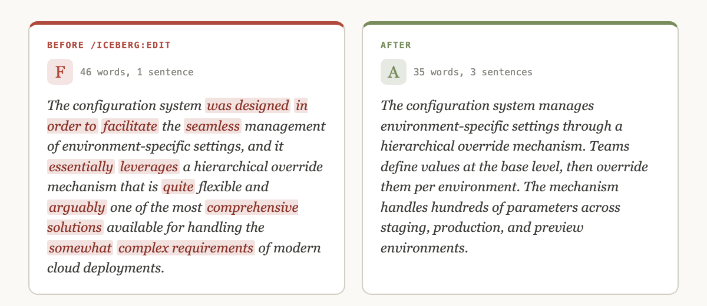

<p></p>

# iceberg

**Claude writes like a consultant. iceberg makes it write like an engineer.**

[](https://github.com/gagoar/iceberg/releases)
[](LICENSE)
[](https://gagoar.github.io/iceberg/)
[](https://github.com/gagoar/iceberg/stargazers)

iceberg is a Claude Code plugin. It grades every plan Claude writes against 14 Hemingway rules. It rewrites any document to an A on request.



Hemingway's iceberg theory gives the plugin its name: a document gets its strength from what you cut, not what you add.

## Install

```
/plugin marketplace add github:gagoar/iceberg
/plugin install iceberg@iceberg
/reload-plugins
```

Prefer one marketplace for all gagoar plugins? Use [gago-plugins](https://github.com/gagoar/gago-plugins):

```
/plugin marketplace add github:gagoar/gago-plugins
/plugin install iceberg@gago-plugins
/reload-plugins
```

## Why

- **It runs on its own.** After install, iceberg scores every plan Claude produces before you read it.
- **It shows its work.** The report quotes every violation with its rule and severity.
- **It has evals.** Haiku and Sonnet gave the same grade on 3 of 3 eval documents. See [`examples/eval/results.md`](examples/eval/results.md).

## 30-second tour

Run `/iceberg:edit` on this paragraph (Grade F, 46 words, one sentence):

> The configuration system was designed in order to facilitate the seamless management of environment-specific settings, and it essentially leverages a hierarchical override mechanism that is quite flexible and arguably one of the most comprehensive solutions available for handling the somewhat complex requirements of modern cloud deployments.

You get this (Grade A, 35 words, three sentences):

> The configuration system manages environment-specific settings through a hierarchical override mechanism. Teams define values at the base level, then override them per environment. The mechanism handles hundreds of parameters across staging, production, and preview environments.

What changed: the passive verb became active. The edit cut the adverbs and qualifiers. Abstract nouns became concrete ones.

Run `/iceberg:score` on a file to see the report without changing it:

```
ICEBERG SCORE — deployment-guide.md
Assumed intent: technical spec

Grade: C      Violations: 18      Words: 290

Rule 1 — Short sentences  [HIGH]  2 violations
  · "The system fetches the config and validates it, which can take up to
    500ms depending on network conditions and cache state." (34w)
Rule 2 — Active voice  [HIGH]  3 violations
  · "The config is loaded by the server"

TOP 3 TO FIX: passive voice, long sentences, vague descriptors
Run /iceberg:edit to apply all fixes.
```

## What you get

| Command | What it does |
|---------|--------------|
| `/iceberg:score <file>` | Grades a document against 14 rules. Never touches the file. |
| `/iceberg:edit <file>` | Rewrites the document inline. Returns the clean text. No annotations. No changelog. |
| `/iceberg:jargon` | Builds your jargon list from an industry pack, your own words, or both. See "Jargon lists" below. |
| Automatic scoring | Scores every plan Claude generates. The report appears at the top of the response. |

Pass an intent to steer the grade: `/iceberg:score path/to/document.md "executive summary"`.

To edit pasted text, run `/iceberg:edit` with no argument and paste.

iceberg leaves code blocks, inline code, command names, variable names, URLs, and proper nouns untouched.

## What runs automatically

iceberg ships one hook, a `Stop` hook in `.claude-plugin/hooks.json`. After each reply it checks the working directory for `.iceberg/last-score.txt`. If the file exists, the hook shows its first 2,000 characters as a status message. It runs `head` and `jq` on that one local file. It makes no network calls and writes no files.

The skills write `.iceberg/last-score.txt` after each score. They read the documents you point them at and write only the documents you ask `/iceberg:edit` to rewrite.

If `.iceberg/jargon.txt` exists, the skills also read it and the bundled packs it names, in the plugin's `skills/jargon/packs/` folder. Only `/iceberg:jargon` writes that file, and only after you confirm or when you run `add` or `remove`. Nothing is sent over the network.

## The 14 rules

| # | Rule | Example |
|---|------|---------|
| 1 | Short sentences | Target 15–20 words. Split at 30. |
| 2 | Active voice | "The server loads the config" — not "The config is loaded" |
| 3 | Strong verbs, no adverbs | "stalls" — not "runs slowly" |
| 4 | No qualifiers or hedges | Delete: *very, quite, arguably, tends to, could potentially* |
| 5 | Concrete nouns | "add a retry loop" — not "implement a comprehensive solution" |
| 6 | One idea per sentence | Break at "and," "which," or "but" when each side stands alone |
| 7 | Conditions before instructions | "If the cache is cold, run the script" — not the reverse |
| 8 | Lead with the answer | Conclusion first. Context follows. |
| 9 | Second person | "You configure the server" — not "We recommend" |
| 10 | Simple words | use, help, start, stop — not utilize, facilitate, initiate, terminate |
| 11 | No negative framing | "Use HTTPS" — not "Don't use HTTP" |
| 12 | Short paragraphs | 2–4 sentences. One topic. |
| 13 | Define or cut jargon | First use gets an inline definition. Plain equivalent beats jargon. |
| 14 | Measure, don't describe | "under 100ms" — not "fast" |

<details>
<summary><b>Grade scale</b></summary>

Grade uses violation density: weighted violations per 100 words. Length does not skew the grade: a clean 2,000-word spec and a clean 100-word summary both get an A.

| Grade | Density (per 100 words) | Meaning |
|-------|------------------------|---------|
| A | ≤ 1.0 | Publish-ready |
| B | ≤ 4.0 | Minor cleanup needed |
| C | ≤ 8.0 | Needs work before sharing |
| D | ≤ 15.0 | Significant rewrite required |
| F | > 15.0 | Start over |

</details>

<details>
<summary><b>Intent profiles</b></summary>

The scorer infers intent from the document's structure, tone, and vocabulary. Pass an explicit intent string to override it. The report shows two grades side by side: objective (default severity on all 14 rules) and intent-adjusted (iceberg deprioritizes rules that don't fit the document type).

| Rule | Technical (default) | Conversational | Executive |
|------|-------------------|---------------|-----------|
| 5 — Concrete nouns | MEDIUM | MEDIUM | HIGH |
| 8 — Lead with answer | MEDIUM | MEDIUM | HIGH |
| 9 — Second person | LOW | skip | LOW |
| 11 — Negative framing | LOW | skip | LOW |
| 12 — Short paragraphs | LOW | skip | HIGH |
| 13 — Jargon | MEDIUM | HIGH | HIGH |

**Technical:** specs, READMEs, API docs, plans. Default severity on all rules.

**Conversational:** guides, tutorials, onboarding docs. "We built this to help you" is expected. iceberg penalizes jargon harder because readers need definitions.

**Executive:** summaries, proposals, recommendations. Buried answers and long paragraphs are penalized hard. Second-person informality is ignored.

</details>

<details>
<summary><b>Extended rules (opt-in)</b></summary>

Three more rules exist outside the core 14. None runs unless you pass its flag. They make tone and content calls that not every document should have forced on.

| Flag | Rule | Example |
|------|------|---------|
| `--no-em-dash` | No em dashes | "Ship it, but test it first." — not "Ship it — but test it first." |
| `--no-weakeners` | No mid-document weakeners | Delete or move to Limitations a clause that undercuts a claim the document just made: "we're still figuring this out," "take this with a grain of salt." |
| `--strip-ai-commentary` | No AI commentary | "The client retries failed requests." — not "I've added retry logic — let me know if you want changes." Strips self-referential assistant voice and dev-cycle narration ("in this PR...", "we then implemented..."). |

Use them with either command:

```
/iceberg:score path/to/document.md --no-em-dash --no-weakeners --strip-ai-commentary
/iceberg:edit path/to/document.md --no-em-dash --no-weakeners --strip-ai-commentary
```

Any flag works alone.

`--no-weakeners` leaves single hedge words to Rule 4. It also ignores anything inside a section labeled Limitations, Caveats, Risks, or Open questions. A caveat in the right place is the document being honest about scope.

`--strip-ai-commentary` keeps legitimate cross-references ("see the Setup section above"). It strips only references to the conversation or process that produced the document. Both `--no-weakeners` and `--strip-ai-commentary` exempt Changelog and release-notes documents, where change history is the point.

</details>

<details>
<summary><b>Long documents and the status line</b></summary>

For documents over 500 words, both skills spawn dedicated subagents (`iceberg-edit`, `iceberg-score`). The main context window stays small.

Run `/statusline-setup` to surface the last score in the Claude Code status bar. The score skill writes `.iceberg/last-score.txt` after every run.

</details>

<details>
<summary><b>Jargon lists (Rule 18)</b></summary>

Give iceberg a list of words you never want in your documents. `/iceberg:edit` replaces or removes them. `/iceberg:score` flags them. The rule runs whenever `.iceberg/jargon.txt` exists. You don't pass a flag.

Run `/iceberg:jargon` to build the file. It asks for your industry, shows a starter list, and writes the file after you confirm. Bundled packs: `technology`, `finance`, `marketing`, `corporate`, `legal`. For any other industry, it drafts a list for you to edit.

```
# .iceberg/jargon.txt
@pack finance            # include a bundled pack
!headwinds               # keep the pack, but allow this word
leverage => use          # replace
synergy                  # bare entry: delete and repair the sentence
move the needle => improve conversion rate
```

| Command | What it does |
|---------|--------------|
| `/iceberg:jargon` | Interview, then writes `.iceberg/jargon.txt`. |
| `/iceberg:jargon add <term> [=> replacement]` | Adds one entry. |
| `/iceberg:jargon remove <term>` | Removes one entry. For a pack term, adds a `!term` line. |
| `/iceberg:jargon --show` | Prints the merged list. |
| `/iceberg:jargon --packs` | Lists the bundled packs. |
| `/iceberg:score <file> --jargon=finance` | Checks one run against a pack, with no file needed. |
| `/iceberg:edit <file> --jargon=finance,legal` | Edits one run against several packs. |

Matching ignores case and covers inflections: `leverage` also catches *leveraged*. A later line replaces an earlier line for the same term, so your entries override a pack. Code blocks, inline code, URLs, proper nouns, and quoted text stay untouched.

Rule 18 runs last in `/iceberg:edit`, so no earlier rewrite can bring a listed word back. Rule 13 judges jargon by reader knowledge. Rule 18 enforces your list. A term on both lists counts once, under Rule 18.

</details>

## FAQ

**Does it change my code?** No. iceberg leaves code blocks, inline code, URLs, and proper nouns untouched.

**Does it cost tokens on long documents?** Documents over 500 words run in a subagent, so your main context stays small.

**Can I turn off the automatic scoring?** Disable the plugin in `/plugin`, or run `/plugin uninstall iceberg@iceberg`.

**Will it update itself?** Auto-update is off by default for third-party plugins. To enable it, open `/plugin`, go to the Marketplaces tab, and toggle auto-update for iceberg. To update by hand, run `/plugin update iceberg@iceberg`, then `/reload-plugins`.

## Contributing

Run the manual checklist in [`TESTING.md`](TESTING.md). Calibration fixtures live in [`examples/eval/`](examples/eval/): `violations.md` (expect Grade F), `clean.md` (expect Grade A), and three model-comparison documents. [`examples/eval/results.md`](examples/eval/results.md) records the Haiku vs Sonnet findings.

Full guide: [gagoar.github.io/iceberg](https://gagoar.github.io/iceberg/guide.html)

## License

MIT — [gagoar](https://github.com/gagoar)
